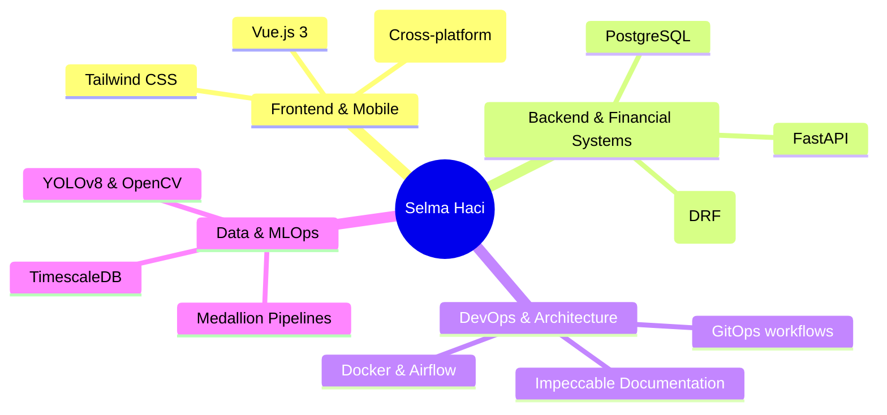
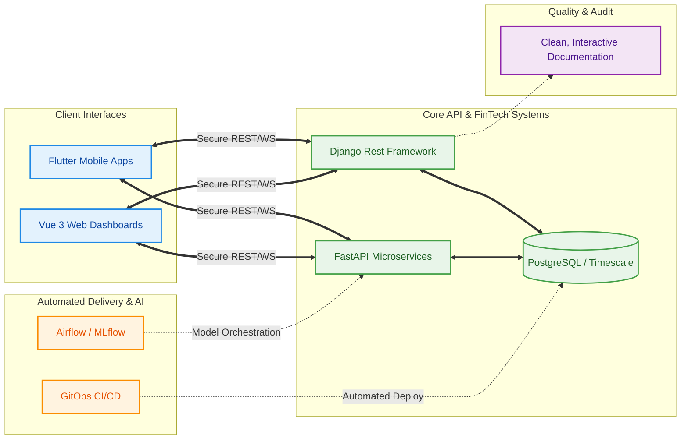

#  Selma Haci | Software Engineer

> **Full-Stack Developer & Aspiring Data Analyst** bridging the gap between intelligent systems, mobile apps, and robust financial pipelines.

---

## Engineering Expertise

*Visualizing my technical stack and core competencies.*

---

##  Architecture Profiles I Build

*How I structure production-grade environments, from FinTech ledgers to Data pipelines.*

---

##  Core Focus Areas

1. **FinTech Architectures**: Building secure, scalable ledgers and transactional API gateways using **DRF** and PostgreSQL.
2. **Interactive Interfaces**: Developing fluid, cross-platform mobile experiences with **Flutter** and high-performance Web dashboards with **Vue 3**.
3. **MLOps & Computer Vision**: Designing automated Medallion data pipelines (Bronze/Silver/Gold) with **FastAPI** to track and monitor AI model drift in real-time.
4. **Engineering Standards**: Implementing strict **GitOps** deployment practices and crafting **Impeccable Documentation** to ensure perfect team handoffs and project longevity.

---

##  Connect With Me

- **Location:** Algiers, Algeria 
- **LinkedIn:** [selma-haci-b5473236a](https://linkedin.com/in/selma-haci-b5473236a)
